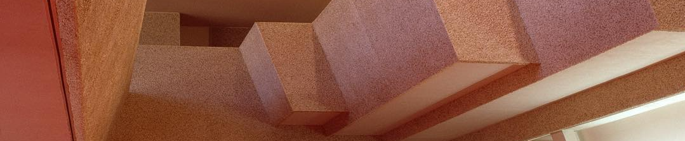

# Brutalismbot

Mirror posts from [/r/brutalism](https://reddit.com/r/brutalism) to Slack.

## How It Works

After granting Brutalismbot permission to post to a #channel on your Slack workspace, Brutalismbot will save a copy of the incoming webhook URL to which it will publish posts.

Every hour Brutalismbot requests posts from reddit's REST API at [`/r/brutalism/new.json`](https://reddit.com/r/brutalism/new).

New image posts that haven't been seen before are saved, transformed into Slack messages using [Block Kit](https://api.slack.com/block-kit), and published to your #channel via the incoming webhook URL.

Example post:

